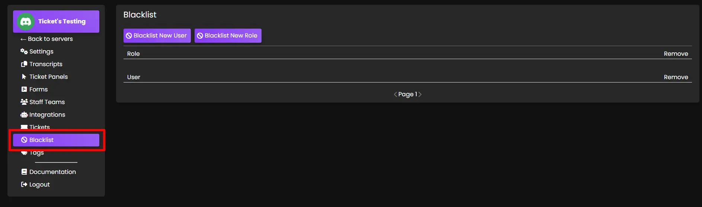
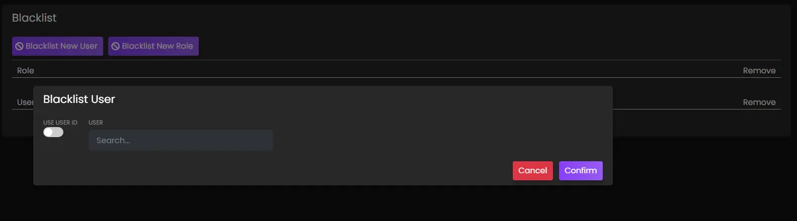
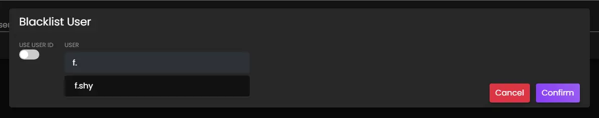
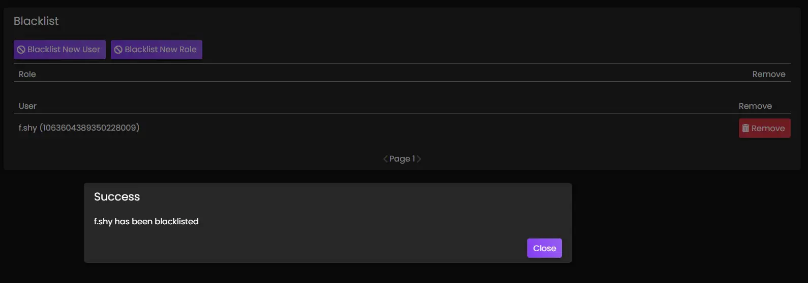
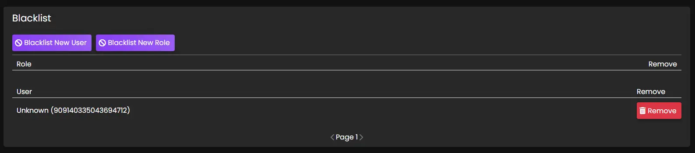
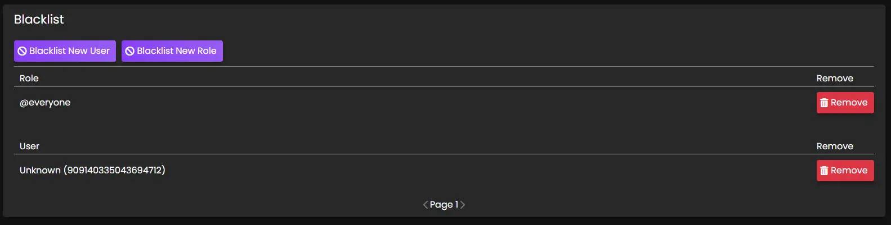

# Blacklist
***

Upon opening the `Blacklist` tab, there will be one main area that displays two buttons and any users/roles that have been blacklisted in your discord server.

## Blacklist New User
To blacklist an individual user from being able to open a ticket, use this button. Once clicked, a new window will appear with a search input.

Start typing the username here and select it when found.

Once the selection is confirmed, a success message will display and the username and ID will be displayed under the `Blacklisted User` section.

### Notes

- Users can also be found by their ID, rather than their username. The `USE USER ID` toggle can be flipped to green and the user ID search input will appear. Paste the user ID here and hit `Confirm` to blacklist.
- User ID's can be found if you have turned on the Discord Developer Mode. This can be found in your user settings.
  - Right click any username and choose `Copy ID`

#### Blacklist New Role
To blacklist a role from being able to open a ticket, use this button. Once clicked, a new window will appear with a search input.

- This is very similar to blacklisting an individual user.

#### Role / User
Those who have been blacklisted will appear in these sections.

- Any role/user can be allowed to make tickets again by removing them from the blacklist by clicking the corresponding `Remove` button next to the role/username.

