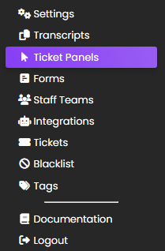
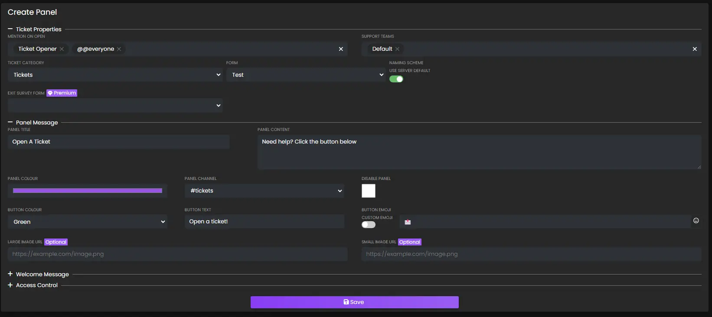

# REACTION PANELS
***
***

Reaction panels are embeds that users can react to in order to open a ticket with a single click:

## Basic Video Walkthrough
***

<video src="../vid/ReactionPanels.mp4" controls poster="../img/video_thumbnails/Thumbnail_Reaction_Panels.webp"></video>

## Creating A Panel
***

In order to create a reaction panel, head over to the web dashboard and select your server. If unfamiliar with how to do that, read our [guide on the web dashboard here](../setup/dashboard.md).

Once on your server's main settings page, select `Reaction Panels` in the top navigation bar to be taken to the reaction panel configuration page which looks as follows:

Focus on the _left_ side of the screen. The right side are settings for combining different panels into a single message.

Draw your attention to the `Create Panel` card. Configure the panel's appearance here:

### Panel Title

The panel title is the bold text at the _top_ of the embed.

> **Note:** The panel title has a maximum length of 255 characters, and by default, it is set to `Open a ticket!`.

### Panel Content

The panel content is the text in the long description of the embed. We recommend providing a general overview of how your support system works, such as which languages the support agents are fluent in.

> **Note:** The panel content has a maximum length of 1024 characters.

### Panel Colour

This is the colour on the left side of the embed. When clicked, a colour picker will open as shown below:

### Panel Channel

This is the channel that the reaction panel will be sent in for users to react to. Therefore, this channel should be accessible to all members, and be the only message in the channel to avoid confusion.

> **Note:** This should **NOT** be the same as your transcript channel.

### Ticket Category

Designates the channel category that the ticket channel will be created under. If unsure of what a channel category is, Discord has a guide explaining them available [here](https://support.discord.com/hc/en-us/articles/115001580171-Channel-Categories-101).

Reaction panels use different channel categories to the one configured on the main settings tab to allow for distinction when using multiple reaction panels - meaning it is possible to have each "type" of ticket open in it's own category for easier organization.

### Form

Assign a form to the panel.

- _Learn more about Forms [here](../features/forms.md)._

### Button Colour

Choose the colour of the button.

### Button Text

Enter the text that the button will contain.

### Button Emoji

This is the emoji that users will click in order to open a ticket. The emoji can either be pasted directly into the box, for example: `📩`, or the Discord name can be used, for example: `envelope_with_arrow` (colons are optional.)

Custom emojis from your server can be used by clicking the toggle to show green instead of grey. When toggled on, the input field will show you a list of your available emojis to choose from.

## Advanced Settings
***

Upon clicking `Toggle Advanced Settings`, extra fields will be displayed:

- [Welcome Message](#welcome-message)
- [Naming Scheme](#naming-scheme)
- [Mention on Open](#mention-on-open)
- [Support Teams](#support-teams)
- [Large Image URL](#large-image-url)
- [Small Image URL](#small-image-url)

### Welcome Message

The server's welcome message can be overridden on a per-panel basis using this field. If left blank, the welcome message from the main settings page will be used.

> **Note:** the message has a maximum limit of 4096 characters due to Discord limitations.

- Placeholders can be used in the welcome message. View a list of placeholders [here](./placeholders.md).

- Discord message formatting can also be used to include links to channels, emojis, roles, or usernames in the welcome message.
  - **First**, discord developer mode must be turned on - in your personal discord account settings > advanced > discord developer mode.
  - **Second**, right click any channel name, username, message, etc and choose `Copy ID`.
  - **Third**, use the `structure` section of [discord's messge formatting chart](https://discord.com/developers/docs/reference#message-formatting) to include it in the welcome message.

### Naming Scheme

This toggle can be used to change the naming scheme of the ticket channels. If it's left on green, it will use the naming scheme set in the `Settings` portion of the Dashboard. If it's flipped to grey, a custom scheme can be setup.

- Placeholders can be used in the custom naming scheme. View a list of placeholders [here](./placeholders.md#custom-naming-scheme-placeholders).

### Mention On Open

Specify a list of roles/users to mention after the ticket is opened.

> **Note:** the message mentioning these roles/users will be deleted instantly, however the mention will still persist until they open the channel. This will not work for those who have their notification settings on mute.

### Support Teams

Input which `Staff Teams` will handle tickets created from this reaction panel.

### Large Image URL

Input a URL link to an image here, it will display **underneath the welcome message**.

- _File path MUST end in .png - easy trick is to send the image as a message in a discord channel, then right click the message and choose "Copy Link." Paste link into the input._

### Small Image URL

Input a URL link to an image here, it will display to the **right of the welcome message**.

- _File path MUST end in .png - easy trick is to send the image as a message in a discord channel, then right click the message and choose "Copy Link." Paste link into the input._

## Completion
***

Once the reaction panel has been configured, click `Submit` and the panel will be created in the server. A success message should be shown in the bottom right hand corner of the screen if successful, or an appropriate error message if there was a mistake:

- If any fields are left blank, the default values will be used.

## Editing
***

Reaction panels can be edited at a later date. Simply click the `Edit` button in the list of panels and the editing modal will be opened:

A panel can also be deleted by clicking the `Delete` button, or deleting the message containing the panel in Discord. If only the message in Discord is deleted, the panel will continue to exist on the Web Dashboard and can be resubmitted to Discord if needed, by clicking the `Resend` button.
A panel can also be deleted by clicking the `Delete` button, or deleting the message containing the panel in Discord. If only the message in Discord is deleted, the panel will continue to exist on the Web Dashboard and can be resubmitted to Discord if needed, by clicking the `Resend` button.