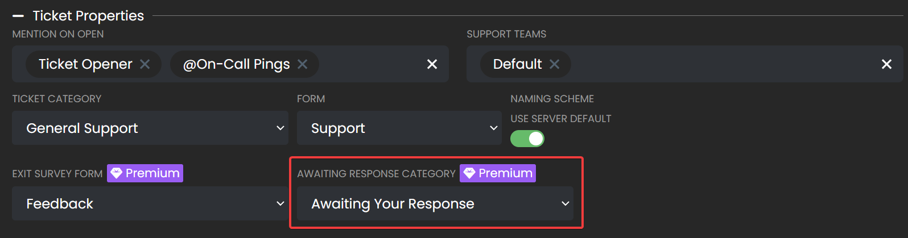

# Awaiting User Response
***

You can now set a category for ticket channels which are awaiting the user's response to be moved to. This feature is highly useful for being able to tell which tickets require a response from staff members, and reduces clutter in your ticket categories.

> **Note:** Channel mode only. Discord does not allow threads to be moved. For more differences between the two modes, click [here](./thread-mode.md#channel-vs-thread-comparison).

10 minutes after the last response from a staff members, the ticket channel will be moved to the awaiting response category.

Due to Discord limitations, a channel can only be updated twice every 10 minutes, so it will not be possible to change how quickly the channel gets moved to the awaiting response category.

> **Note** This feature is only for servers that have premium activiated. Learn more about premium [here](https://ticketsbot.net/premium).