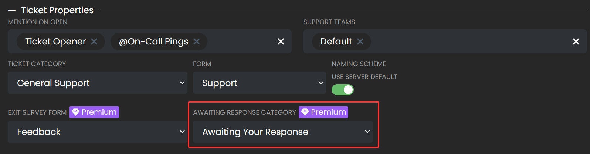

# Awaiting Your Response
***

You can now set a category for ticket channels which are awaiting the user's response to be moved to. This feature is highly useful for being able to tell which tickets require a response from staff members, and reduces clutter in your ticket categories.

10 minutes after the last response from a staff members, the ticket channel will be moved to the awaiting response category.

> **Note** This feature is only for servers that have premium activiated. Learn more about premium [here](https://ticketsbot.net/premium).