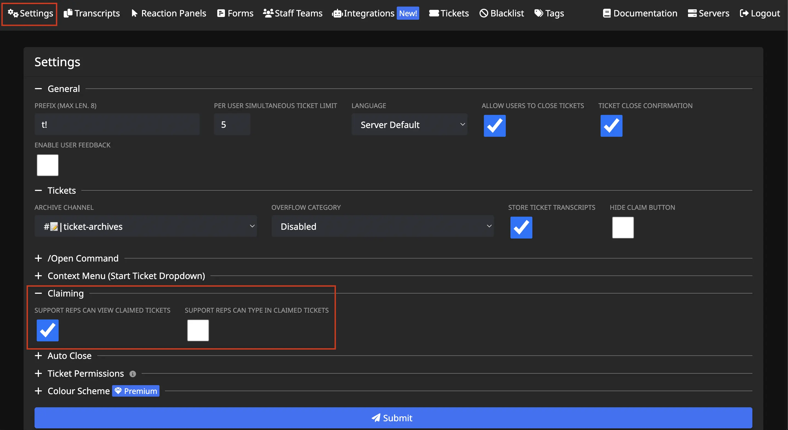

# Claiming
***
***

Tickets can be claimed by a staff member, so other staff members cannot also reply to the ticket. The benefit of this is that tickets become less cluttered with many staff members talking at once.
Alternatively, an admin could claim a ticket to keep the support team from seeing potentially sensitive issues.

Note: Admins will always have access to any claimed ticket, as well as the user who claimed it.

## Commands Related to Claiming:
***

- /claim - Assigns you to a ticket
- /transfer @User - Transfers a claimed ticket to another user
- /unclaim - Removes the claim on the current ticket

## Claiming can be configured in 3 ways:
***
<!-- SHOULD WE PUT A PHOTO OF THE CONFIGURED CHECKBOXES FOR EACH OPTION??? -->
- All staff members can see the ticket, but only the claimer can reply (Default)
- All staff members can see the ticket, and all staff members can reply
- Only the claimer can see the ticket

You can configure which methodology is used on the dashboard's settings tab:

