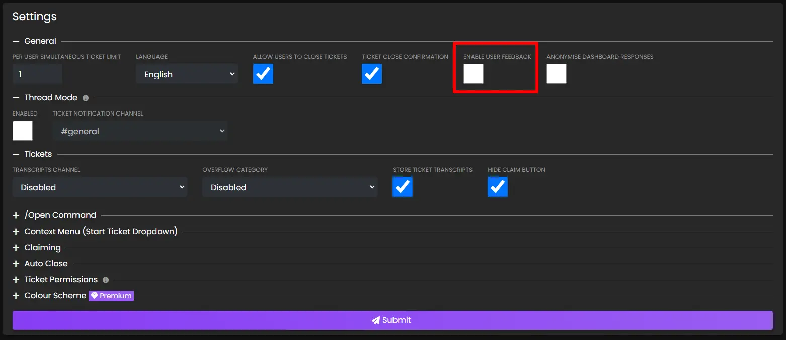
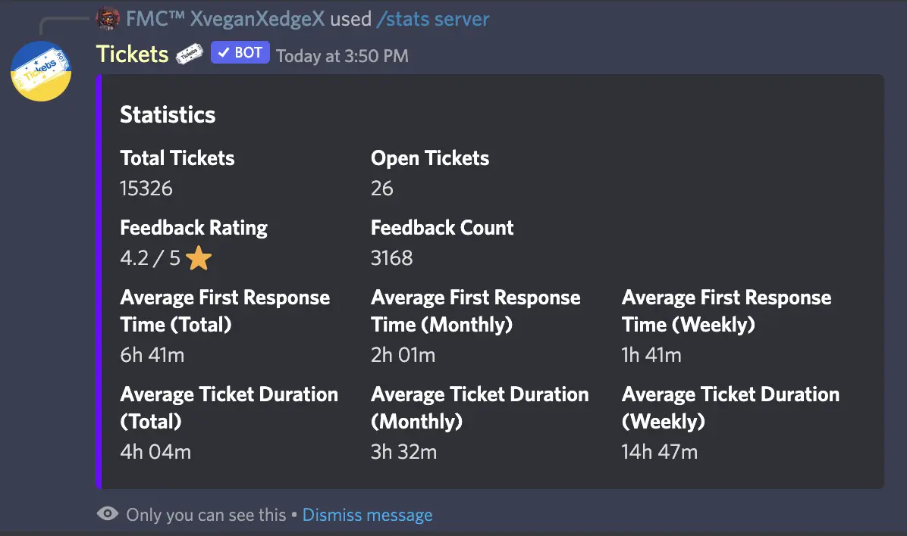
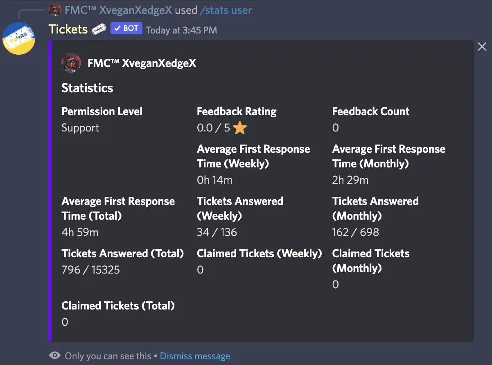
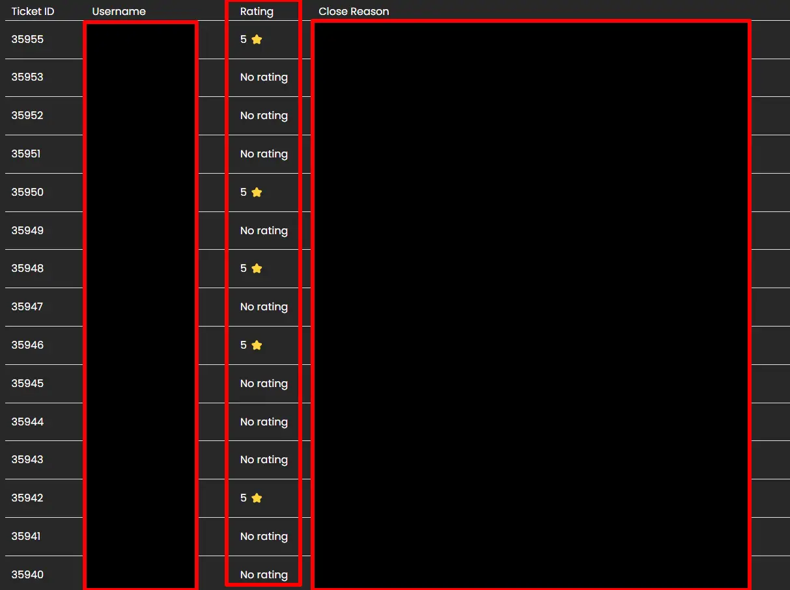

# Feedback
***

Tickets allows your users to provide feedback on the support they received:

## Enabling Feedback
In order for users to be asked to rate your service, you must first enable feedback on the [web dashboard](https://dashboard.ticketsbot.net/). 

Select your server and open the settings page:

Check the `Enable User Feedback` box and press submit.
Next time a user closes a ticket, they will be asked for feedback.

## Viewing Feedback
There are several ways to view feedback:

### Server Stats
If you are a [premium](https://ticketsbot.net/premium) subscriber, you can view your feedback statistics with `/stats server`:

### User Stats
If you are a [premium](https://ticketsbot.net/premium) subscriber, you can use `/stats user` to view the average rating on tickets claimed by a specific user:

### Placeholders
You can include the following placeholders in your welcome message to display your feedback rating to users:
- %average_rating%
- %rating_count%

> **Note:** View more placeholders by clicking [here](./placeholders.md).

### Viewing Individual Ticket Ratings
You can view the ratings of individual tickets by navigating to the transcripts page on the dashboard. Next to each ticket, the rating given by the user will be shown:

