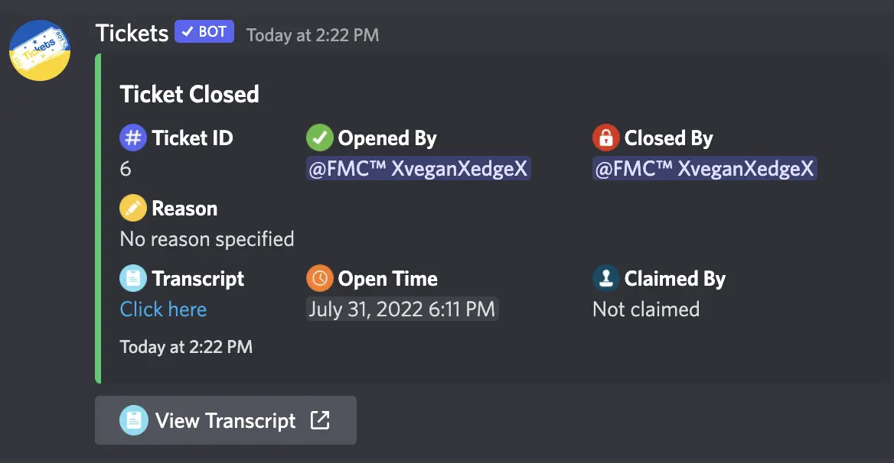

# Settings
***
***

Upon opening the `Settings` menu, extra sections will be displayed (with the first two being expanded):
- General
- Tickets
- /Open Command
- Context Menu (Start Ticket Dropdown)
- Claiming
- Auto Close
- Colour Scheme

## General
***

Here you will find settings that affect the entire server, not just a specific reaction panel.

### Prefix
You can change the command prefix from the default of `t!`.  Discord will be forcing all bots to only use slash commands very soon, so don't get used to controlling the bot this way.

### Per User Simultaneous Ticket Limit
Set the max amount of tickets a server member can have open (staff is immune to this limit.)  
- *This is total nuber of tickets **per member**, not per panel.*

### Language
Set the bot's language.  
- *Learn more about this [here](../../setup/languages.md).*

### Allow Users To Close Tickets
Toggle whether the server members that open tickets can close them (or if that will be a permission only given to staff.)

### Ticket Close Confirmation
Toggle whether a second confirmation is required to close a ticket.

### Enable User Feedback
Toggle whether a user can provide a star rating feedback on the service they received. See more about this [here](../../setup/feedback.md).

## Tickets
***

This section has a few more optional settings.

### Archive Channel
Select if/which channel should receive an embedded message containing a summary of each closed ticket. If you have also chosen to store transcripts (see below) there will also be a link to the transcript. Only those who had access to the ticket (plus all those with administration permissions in the server) will be able to access it.

### Overflow Category
Discord has a limit of 50 channels to a category (and 500 channels total per server), so here is where another category can be selected for tickets to go into if the first Ticket Category is full.  
- *Learn more about ticket category [here](../reaction-panels.md#ticket-category).*

### Store Ticket Transcripts
Toggle whether transcripts of each ticket are stored for later review by your staff.

### Hide Claim Button
Toggle whether the "Claim" button is shown in each ticket.  
- *Learn more about claiming [here](./claiming.md).*

## /Open Command
***

This section has settings when using the `/open` command to create a ticket.

### Disable /Open Command
Toggle whether server members can use `/open` to create a ticket.

### Channel Category
Select which category the open tickets will be shown.

### Naming Scheme
Select a naming scheme:
Ticket followed by numbers or Ticket followed by the username of opener

### Welcome Message
The welcome message is the message displayed in the Ticket as soon as the user opens it:

Note, the message has a maximum limit of 1024 characters due to Discord limitations.

You may make use of placeholders in your welcome message. View a list of placeholders [here](../../setup/placeholders.md).

The title of the embed will either be based off of the subject provided by the user when using `/open [Subject]`, or the title will show "No subject given" if one wasn't input. 

## Context Menu (Start Ticket Dropdown)
***

This section has settings dealing with tickets that are created via the context menu (right clicking a message.)

- There is a dedicated page documenting this section [here](../../features/start-ticket-from-message.md).

## Claiming
***

This section has the settings dealing with claiming tickets.

- There is a dedicated page documenting this section/feature [here](./claiming.md).

## Auto Close
***

This section has settings dealing with automated closing of tickets.

### Enabled
Toggle whether any auto-close features work or not.
- *Must be checked for rest of section to work.*

### Close On User Leave
Toggle whether you'd like open tickets to be automatically closed if the Ticket Opener leaves the server.

### Since Open With No Response
Set a timeframe in the boxes. If Ticket Opener does not type a message within that timeframe, the ticket will be closed automatically.
- *This is a premium feature. Learn more about premium [here](https://ticketsbot.net/premium).*

### Since Last Message
Set a timeframe in the boxes. If no messages occur within that timeframe, the ticket will be closed automatically.
- *This is a premium feature. Learn more about premium [here](https://ticketsbot.net/premium).*

## Ticket Permissions
***

In this area you can define if some permissions are given to the users who open tickets.  

- **Green toggle buttons** - user **will** receive this permission in their respective ticket channel.  
- **Grey toggle buttons** - user **will not** receive this permission in their respective ticket channel.

## Colour Scheme
***

Select custom colours for the embedded messages from Tickets bot.
- *This is a premium feature. Learn more about premium [here](https://ticketsbot.net/premium).*

## Completion
***

Once you have configured these settings to your liking, click `Submit` for them to take effect in your server. 

## Editing
***

If you wish to update your settings at a later date, simply change the desired settings and click `Submit` again.
