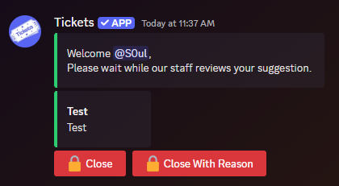

# SETTINGS

---

---

Upon opening the `Settings` menu, extra sections will be displayed (with the first two being expanded):

- [General](#general)
- [Thread Mode](#thread-mode)
- [Tickets](#tickets)
- [/Open Command](#open-command)
- [Context Menu (Start Ticket Dropdown)](#context-menu-start-ticket-dropdown)
- [Claiming](#claiming)
- [Auto Close](#auto-close)
- [Colour Scheme](#colour-scheme)

## General

---

Here you will find settings that affect the entire server, not just a specific reaction panel.

### Prefix

> **Note:** prefix commands are no longer active! Tickets bot works solely on slash commands! No need to setup a prefix.

~~You can change the command prefix from the default of `t!`. Discord will be forcing all bots to only use slash commands very soon, so don't get used to controlling the bot this way.~~

### Per User Simultaneous Ticket Limit

Set the max amount of tickets a server member can have open (staff is immune to this limit.)

- _This is total number of tickets **per member**, not per panel._

### Language

Set the bot's language.

- _Learn more about Language Customization [here](../../setup/languages.md)._

### Allow Users To Close Tickets

Toggle whether the server members that open tickets can close them (or if that will be a permission only given to staff.)

### Ticket Close Confirmation

Toggle whether a second confirmation is required to close a ticket.

### Enable User Feedback

Toggle whether a user can provide a star rating feedback on the service they received. 

- _Learn more about User Feedback [here](../../setup/feedback.md)._

## Thread Mode

---

We now support using private threads for tickets! This is a new optional mode for the bot that drastically changes how tickets operate.

- _Learn more about Thread Mode [here](../../features/thread-mode.md)._

### Enabled

Toggle whether tickets are created using Channel Mode or Thread Mode.

- _Must be checked for rest of section to work._

### Ticket Notification Channel

Select which channel should receive the embedded messages containing a notification to your staff that a ticket has been opened. This same message will also have a button for your staff to click and join the ticket thread.

## Tickets

---

This section has a few more optional settings.

### Transcripts Channel

Select if/which channel should receive an embedded message containing a summary of each closed ticket. If you have also chosen to store transcripts (see below) there will also be a link to the transcript. Only those who had access to the ticket (plus all those with administration permissions in the server) will be able to access it.

### Overflow Category

Discord has a limit of 50 channels to a category (and 500 channels total per server), so here is where another category can be selected for tickets to go into if the first Ticket Category is full.

- _Learn more about Ticket Category [here](../reaction-panels.md#ticket-category)._

### Store Ticket Transcripts

Toggle whether transcripts of each ticket are stored for later review by your staff.

### Hide Claim Button

Toggle whether the `Claim` button is shown in each ticket.

- _Learn more about Claiming [here](./claiming.md)._

## /Open Command

---

This section has settings when using the `/open` command to create a ticket.

### Disable /Open Command

Toggle whether server members can use `/open` to create a ticket.

### Channel Category

Select which category the open tickets will display.

### Naming Scheme

Select a naming scheme:
Ticket followed by numbers or Ticket followed by the username of opener.

### Welcome Message

The welcome message is the message displayed in the Ticket as soon as the user opens it:

> **Note:** the message has a maximum limit of 4096 characters due to Discord limitations.

- Placeholders can be used in the welcome message. View a list of placeholders [here](./placeholders.md).

- Discord message formatting can also be used to include links to channels, emojis, roles, or usernames in the welcome message. 
  - **First**, discord developer mode must be turned on - in your personal discord account settings > advanced > discord developer mode. 
  - **Second**, right click any channel name, username, message, etc and choose `Copy ID`.  
  - **Third**, use the `structure` section of [discord's messge formatting chart](https://discord.com/developers/docs/reference#message-formatting) to include it in the welcome message.

The title of the embed will either be based off of the subject provided by the user when using `/open [Subject]`, or the title will show "No subject given" if one wasn't input.

## Context Menu (Start Ticket Dropdown)

---

This section has settings dealing with tickets that are created via the context menu (right clicking a message.)

- There is a dedicated page documenting this section [here](../../features/start-ticket-from-message.md).

## Claiming

---

This section has the settings dealing with claiming tickets.

- There is a dedicated page documenting this section/feature [here](./claiming.md).

## Auto Close

---

This section has settings dealing with automated closing of tickets.

### Enabled

Toggle whether any auto-close features work or not.

- _Must be checked for rest of section to work._

### Close On User Leave

Toggle whether you'd like open tickets to be automatically closed if the Ticket Opener leaves the server.

### Since Open With No Response

Set a timeframe in the boxes. If Ticket Opener does not type a message within that timeframe, the ticket will be closed automatically.

- _This is a premium feature. Learn more about premium [here](https://ticketsbot.net/premium)._

### Since Last Message

Set a timeframe in the boxes. If no messages occur within that timeframe, the ticket will be closed automatically.

- _This is a premium feature. Learn more about premium [here](https://ticketsbot.net/premium)._

## Ticket Permissions

---

In this area you can define if some permissions are given to the users who open tickets.

- **Green toggle buttons** - user **will** receive this permission in their respective ticket channel.
- **Grey toggle buttons** - user **will not** receive this permission in their respective ticket channel.

## Colour Scheme

---

Select custom colours for the embedded messages from Tickets bot.

- _This is a premium feature. Learn more about premium [here](https://ticketsbot.net/premium)._

## Completion

---

Once you have configured these settings to your liking, click `Submit` for them to take effect in your server.

## Editing

---

If you wish to update your settings at a later date, simply change the desired settings and click `Submit` again.
