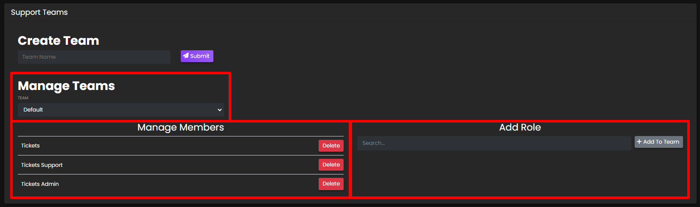
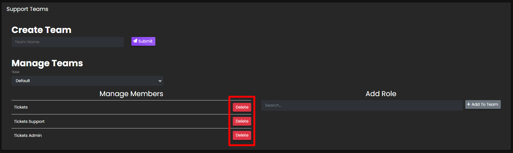

# Staff Teams
***

Staff Teams can be used to further customize which of your staff members can see, claim, respond to, and close specific types of tickets. This is possible because Staff Teams get linked to individual reaction panels however you see fit. Click to learn more about [reaction panels](../dashboard/reaction-panels.md) or the [support teams input](../dashboard/reaction-panels.md/#support-teams).

## Basic Video Walkthrough
<video src="../vid/StaffTeams.mp4" controls poster="../img/video_thumbnails/Thumbnail_Staff_Teams.webp"></video>

## Primary View
Upon opening the `Staff Teams` menu, there will be two main areas displayed:
- [Create Team](#create-team)
- [Manage Teams](#manage-teams)

## Create Team
Create new Staff Teams here by typing in a team name and clicking `Submit`.
- *A team must exist before it can be managed.* 

## Manage Teams
Options for managing a team:
- [Staff Teams](#staff-teams)
  - [Basic Video Walkthrough](#basic-video-walkthrough)
  - [Primary View](#primary-view)
  - [Create Team](#create-team)
  - [Manage Teams](#manage-teams)
    - [Delete a Staff Team](#delete-a-staff-team)
    - [Add Members / Roles to a Staff Team](#add-members--roles-to-a-staff-team)
    - [Remove Members / Roles from a Staff Team](#remove-members--roles-from-a-staff-team)
  - [Default Team](#default-team)

### Delete a Staff Team
Select the team you wish to delete, and a red `Delete` button will appear next to #1 of photo above.

### Add Members / Roles to a Staff Team
- **Select** the team in which you wish to add the members/roles (**#1**)
- **Search** for the member or role you wish to add (**#3**) and click `+ Add To Team`
- **Member/Role will appear** in area **#2** of photo above

### Remove Members / Roles from a Staff Team
- **Select** the team in which you wish to remove the members/roles (**#1**)
- **Click** `Delete` button next to the name of member/role to remove, in area **#2** of photo above

## Default Team
The Default team cannot be deleted. Those members/roles added with the `/addadmin` and `/addsupport` commands get added to this team automatically.  
- *Learn more about these two commands [here](../commands/add-admin-support.md).*  
- *Learn more about the rest of the commands [here](../commands/commands.md)*
