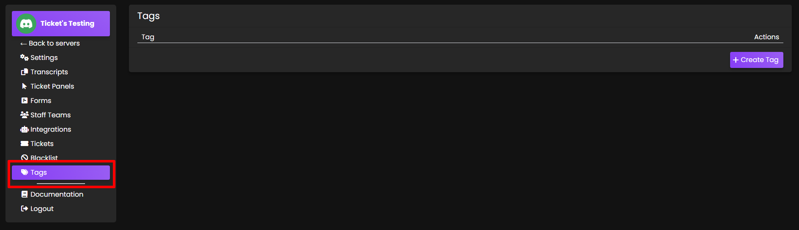
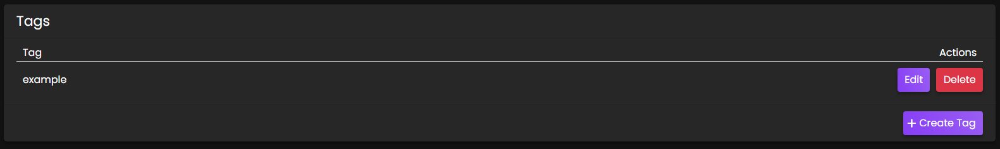
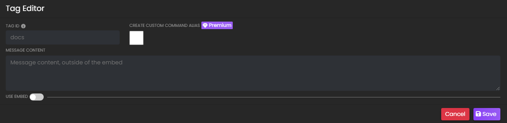
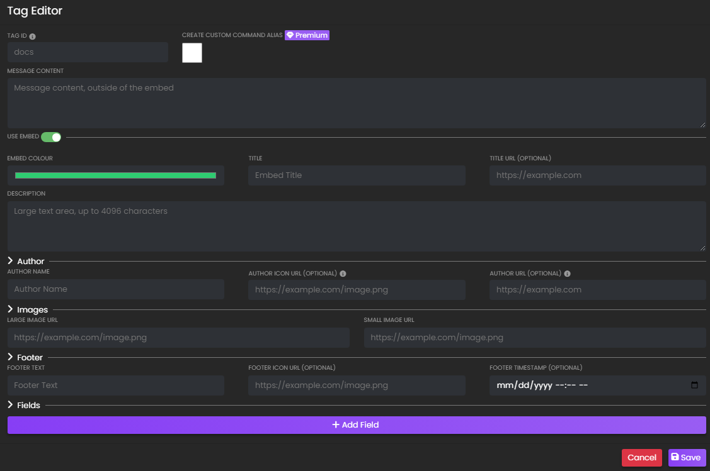

# Tags
***

Tags are pre-defined snippets of text sent by the bot. These can be useful for quickly sending responses to commonly asked questions or concerns.

## Primary View
Upon opening the `Tags` menu, there will be one main area that displays any tags that have been created and a button to create new tags.

When there are created tags, each tag name will show and some action buttons - `Edit` and `Delete`

## Creating a Tag
Clicking the `+ Create Tag` button will bring up the Tag Editor.

### Tag ID
This is the "name" of the tag and what will be used in the command (i.e. if ID is "docs", command is `/tag docs`.)

### Message Content
This is how the bot will respond when the command is used.

## Use Embed
- *Bot responses may also be in customisable embeds complete with images, if desired.*

Flipping the `Use Embed` toggle to green will display some more sections:
- [Tags](#tags)
  - [Primary View](#primary-view)
  - [Creating a Tag](#creating-a-tag)
    - [Tag ID](#tag-id)
    - [Message Content](#message-content)
  - [Use Embed](#use-embed)
    - [Embed](#embed)
    - [Author](#author)
    - [Images](#images)
    - [Footer](#footer)
    - [Fields](#fields)
  - [Using a Tag](#using-a-tag)

### Embed
 - **Embed Colour**
   This is the colour on the left side of the embed. When clicked, a colour picker will open as shown below:

 - **Title**
   The embed title is the bold text at the *top* of the embed. The embed title has a maximum length of 255 characters. 

 - **Title URL (optional)**
   The embed title can be turned into a hyperlink to a webpage by filling out this input.

 - **Description**
   This is the message content of the embed.

### Author
 - **Author Name**
   This will display **above the embed title**.

 - **Author Icon URL (optional)**
   This will display to the **left of the author name**.

 - **Author URL (optional)**
   The author name can be turned into a hyperlink to a webpage by filling out this input.

### Images
 - **Large Image URL**
    Input a URL link to an image here, it will display at the **bottom of the embed**.  
   - *File path MUST end in .png - easy trick is to send the image as a message in a discord channel, then right click the message and choose "Copy Link." Paste link into the input.*

 - **Small Image URL**
    Input a URL link to an image here, it will display at the **top right of the embed**.  
   - *File path MUST end in .png - easy trick is to send the image as a message in a discord channel, then right click the message and choose "Copy Link." Paste link into the input.*

### Footer
 - **Footer Text**
    Will display **below the Large Image at the bottom of the embed**. This text is a little smaller than the Description.

 - **Footer Icon URL (optional)**
    Input a URL link to an image here, it will display to the **left of the Footer Text**.  
   - *File path MUST end in .png - easy trick is to send the image as a message in a discord channel, then right click the message and choose "Copy Link." Paste link into the input.*

 - **Footer Timestamp (optional)**
    Choose a date here, it will display **after the Footer Text**.

### Fields
  Additional fields can be added to the embed. Think of these as sections. The field name will appear in bold (as a title to the section), and the Field Value is the text within the section.

*Example tag embed with Fields not inline*

 - **Field Name**
    This is the title of the new field section that will appear in the embed. It will display in bold.

 - **Inline**
    *Checked* = Fields display horizontally (columns on the same row)  
    *Unchecked* = Fields display vertically

 - **Field Value**
    This is the description section of the new field that will appear in the embed.

*Example tag embed with Fields inline*

## Using a Tag
Within Discord, use the `/tag` command by typing `/tag` and selecting the tag ID from menu, or type the full `/tag [tagname]`  
