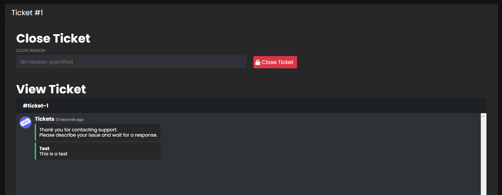
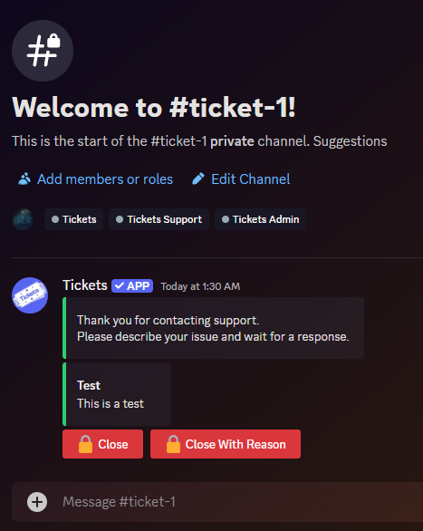

# TICKETS
***
***

Upon opening the `Tickets` menu, there will be one main area that displays any open tickets in your discord server.

## ID
***

The unique identification number of the ticket will display.

## Panel
***

The reaction panel name of the ticket will display.  
- *Learn more about reaction panels [here](./reaction-panels.md).*

## User
***

The user who opened the ticket will display.

## View
***

Click to view the current state of the ticket.  
  
If we clicked `View` on ticket #15, this would be displayed:

For comparison, this is the current state of ticket #15 in the discord server:

The ticket can be closed from this view, with or without a reason specified.

### Premium Perks
Those with premium, will get real-time updates, be able to respond to messages, and close the ticket in this view.  
- *Learn more about premium [here](https://ticketsbot.net/premium).*