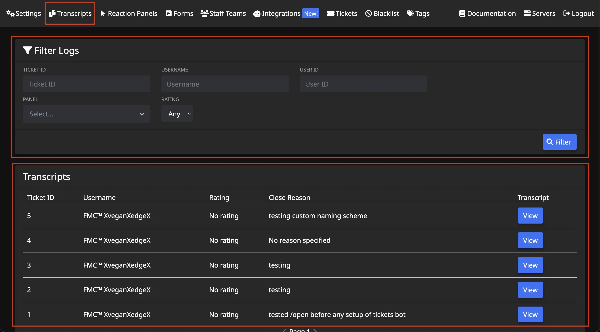

# Transcripts
***

Upon opening the `Transcripts` menu, you'll have two cards displayed to you:
- Filter Logs
- Transcripts

## Filter Logs
Here you can filter the transcripts shown down in the other section.  
  
Fill out the inputs as you desire and click `Filter` button.

## Transcripts
Here you can view transcripts of closed tickets.

### Ticket ID
This unique ticket number cannot be reset or changed.

### Username
Discord username of the ticket opener.

### Rating
If user feedback is enabled, the feedback rating given by ticket opener will display.  
- *Learn more about User Feedback [here](../setup/feedback.md).*

### Close Reason
If `close with reason` button was selected (or `/close` was used and a reason was input), it will display. Otherwise, it will display "No reason specified."

### Transcript
Click to view the transcript.