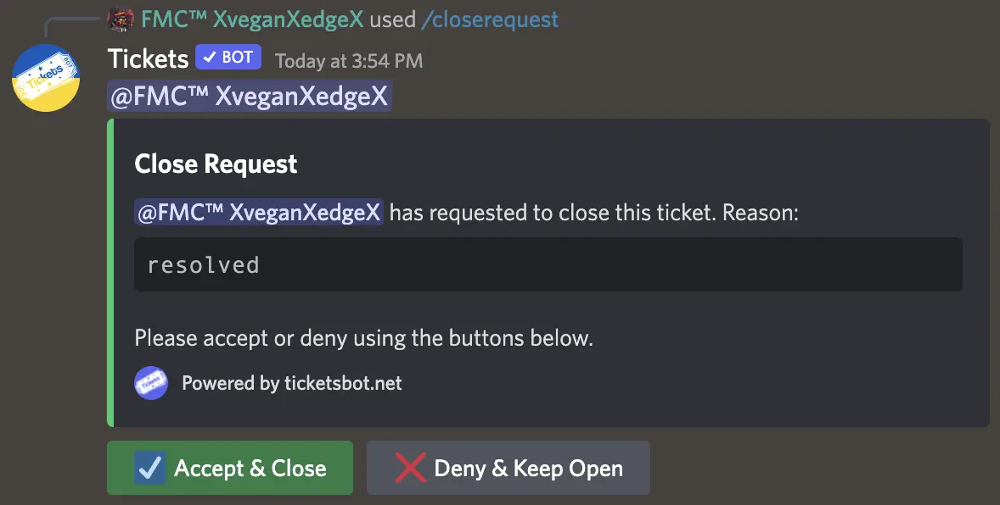

# Close Requests
***

Another unique feature of Tickets is close requests.

When you feel a ticket is able to be closed, you can use the `/closerequest` command to ask the user to confirm they feel everything is resolved:

If the user chooses to deny the request, the message will be updated:

## Timeouts

Additionally, you can specify a time (in hours) after which the ticket will be closed automatically if the user has not responded, and a reason for closure of the ticket:

If a close delay is not specified, the ticket will not be closed until the user accepts the request.

## Notes
- If you exclude a ticket from being automatically closed via `/autoclose exclude`, close request timeouts will not apply, even if provided.
