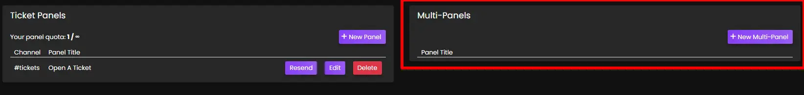
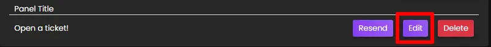

# Multi Panels
***

Multi-panels are the combination of 2 or more Reaction Panels in a single embed:

## Creating A Multi-panel
In order to create a multi-panel, you'll need to head over to the web dashboard and select your server. If you're unfamiliar with how to do that, read our [guide on the web dashboard here](../setup/dashboard.md).

Once on your server's main settings page, select `Reaction Panels` in the top navigation bar and you'll be taken to the reaction panel configuration page which looks as follows:

You'll want to focus on the *right* side of the screen. The left side are settings for individual panels (known as [Reaction Panels](../dashboard/reaction-panels.md).)

Draw your attention to the `Create Multi-Panel` card. You'll configure the panel's appearance here:

### Panel Title
The panel title is the bold text at the *top* of the embed. The panel title has a maximum length of 255 characters. By default, we set the value to `Open a ticket!`

### Panel Content
The panel content is the text in the long description of the embed. It has a maximum length of 1024 characters. We recommend providing a general overview of how your support system works, such as which languages you have support staff fluent in.

### Panel Colour
This is the colour on the left side of the embed. When clicked, a colour picker will open as shown below:

### Panel Channel
This is the channel that the multi-panel will be sent in for users to react to. Therefore, this channel should be accessible to your users, and be the only message in the channel to avoid confusion.

**This should not be the same as your archive / transcript channel.**

### Panels
This input field is where you select which of your already made individual panels you'd like to include in the multi-panel.

### Use Select Menu
- **Unchecked** = Ticket options appear as clickable buttons. 
- **Checked** = Ticket options appear as a dropdown menu.

## Advanced Settings
Upon clicking `Toggle Advanced Settings`, you'll have extra fields displayed to you:
- [Large Image URL](#large-image-url)
- [Small Image URL](#small-image-url)

### Large Image URL
Input a URL link to an image here, it will be shown **underneath the welcome message**.  
- *File path MUST end in .png - easy trick is to send the image as a message in a discord channel, then right click the message and choose "Copy Link." Paste link into the input.*

### Small Image URL
Input a URL link to an image here, it will be shown to the **right of the welcome message**.  
- *File path MUST end in .png - easy trick is to send the image as a message in a discord channel, then right click the message and choose "Copy Link." Paste link into the input.*

## Completion
***

Once you have configured the multi-panel to your liking, click `Submit` and the panel will be created in your server. You should be shown a success message in the bottom right hand corner of your screen if successful, or an appropriate error message if you made a mistake:

- If you leave any fields blank, the default values will be used.

## Editing
If you wish to update a multi-panel at a later date, simply click the edit button in the list of multi-panels and the editing modal will be opened:

You can also delete a multi-panel by clicking the `Delete` button, or deleting the message containing the multi-panel in Discord. If you only delete the message in Discord, the multi-panel will continue to exist on your Dashboard and you can resubmit it to Discord if needed.