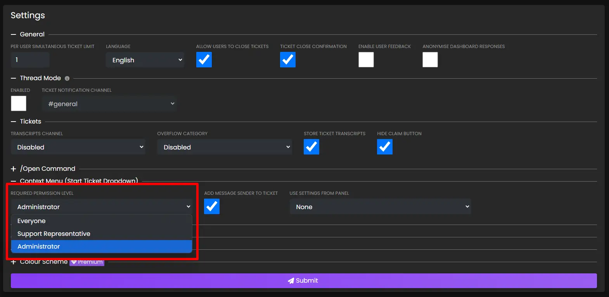
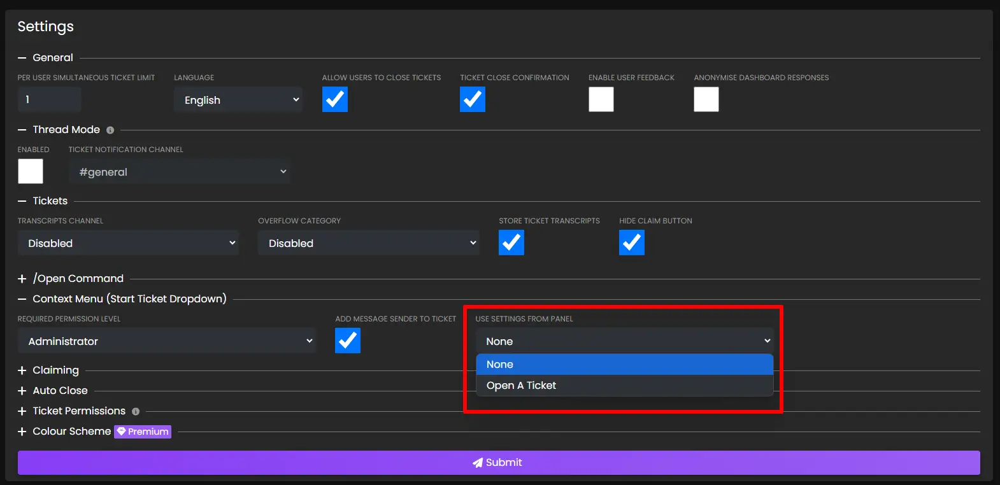

# Start Ticket From Message
***

Did you know that you can start a ticket from a channel using message context menus?

This is a similar functionality to Discord private threads. A common use case is for using tickets to perform moderation, where you can drag a user into a ticket to discuss a specific message with them.

## How To Use
To start a ticket from a message, simply right click the message (or long press on mobile devices), hover over `Apps`, and select `Start Ticket`:

A new ticket will be created with the user who sent the message. The bot will send a message quoting the user, as well as providing a link to the message:

## Configuration
### Required Permission Level
To limit usage of this functionality to staff members: visit the [web dashboard](../setup/dashboard.md), select your server, and take a look at the `Settings` page.

You will see a dropdown menu labelled `Required Permission Level` under the `Context Menu (Start Ticket Dropdown)` heading. Adjust the setting to your wish, and then press the `Submit` button.

### Add Message Sender To Ticket
If you are using this functionality for users to report messages, you may not wish to have the person who is being reported added to the ticket for anonymity.

This will also stop the `Conversation moved to ticket` message from being sent.

### Use Settings From Panel
By default, tickets opened via the context menu use the `/open` command settings. If you wish to use the settings of a specific reaction panel, i.e. so you can use `Mention On Open`, select the panel you wish to use under the `Use Settings From Panel` dropdown.

