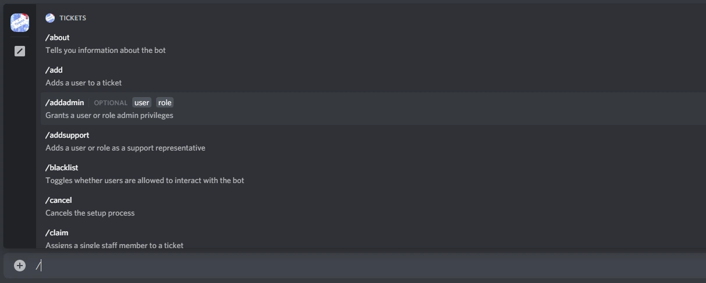

# Bot Configuration
***

Let's start getting the bot ready for use in your server!

Tickets was a very early adopter of slash commands, meaning that you can simply hit `/` in your Discord client to have commands auto-completed with the correct arguments:

If you're not the owner of the server, now would be a good time to get the owner to designate you as an admin of Tickets. You can do this by asking the owner to run the command `/addadmin @YourUsername` in a channel the bot can see. If successful, Tickets will show you a ✅.

We've created a few different ways in which you can configure the bot:
- Via the [web dashboard](https://dashboard.ticketsbot.net) **[Recommended]**
- Via `/setup`
  - Auto
  - Individual Settings

> **Note:** We recommend using the web dashboard to configure the bot, as it's easier and more settings are available - including reaction panels.

If you'd prefer to stick to configuring the bot via commands in Discord, there are a few different methods in which you can do so:
- `/setup auto` will automatically create roles, channels, and everything else you need (excluding reaction panels) without any interaction required from you. This is okay for simple usecases, but you'll likely want to configure the options yourself.
- **Individual Settings**: Run commands such as `/setup category` and `/setup welcomemessage` to change individual settings one by one.

We have guides on each of the available methods:
- [Web Dashboard](./dashboard.md) **[Recommended]**
- [Auto](./auto.md)
- [Individual Settings](./individual.md)
