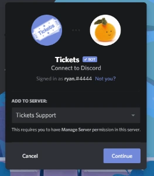
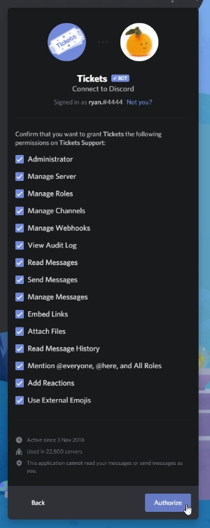

# Inviting the bot  
 
To get started with adding Tickets to your server, visit [invite.ticketsbot.net](https://invite.ticketsbot.net): you'll be redirected to Discord automatically.  
  
You'll first be asked to select the server you want to add Tickets to. Note, you must have the **Manage Server** permission in this server in order to add bots:  

Upon pressing continue, you'll be presented with a list of permissions Tickets is asking for. It is important that you allow the bot all of these permissions to ensure successful operation. However, you *are* able to remove the Administrator permission if you so wish, but please make sure you do not have any deny permission overrides applied to roles the bot has (including @everyone) on your channel categories. Click `Authorize` to proceed.

Discord will then present you with a screen stating that you've authorised the bot: it's now in your server! Let's start configuring the bot: [Bot Configuration](./configuration.md)
