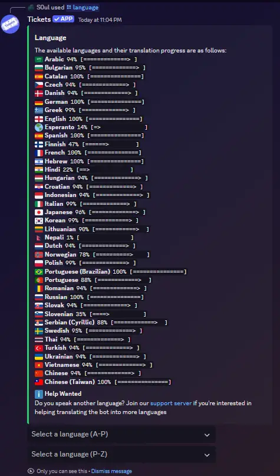

# LANGUAGE CUSTOMIZATION
***
***

Tickets is highly accessible, supporting over 20 languages at the time of writing.

Use the `/language` command with a 2 digit country code to switch your server's language (e.g. `/language de`.)

If an invalid country code is entered, a list of languages, along with their translation progress will be presented:

If you do not have a language selected, your server's preferred language will be used:

## Limitations
***

- The bot does not currently support server-level customisation of individual messages
- Some messages, such as embed titles and some button messages, are not currently translated

## Help Wanted
***

If you are multilingual and interested in helping translate the bot into more languages (or getting languages to 100%), please join our [support server](https://discord.gg/bh6aAfP) and let us know!