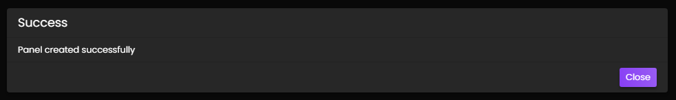

# Reaction Panels
Reaction panels are embeds that users can react to in order to open a ticket with a single click:

## Creating A Panel
In order to create a reaction panel, you'll need to head over to the web dashboard and select your server. If you're unfamiliar with how to do that, read our [guide on the web dashboard here](./dashboard.md).

Once on your server's main settings page, select `Reaction Panels` in the top navigation bar and you'll be taken to the reaction panel configuration page which looks as follows:

You'll want to focus on the *left* side of the screen. The right side are settings for combining different panels into a single message.

Draw your attention to the `Create A Panel` card. You'll configure the panel's appearance here:

## Panel Title
The panel title is the bold text at the *top* of the embed. The panel title has a maximum length of 255 characters. By default, we set the value to `Open a ticket!`

## Panel Content
The panel content is the text in the long description of the embed. It has a maximum length of 1024 characters. We recommend providing a general overview of how your support system works, such as which languages you have support agents fluent in.

## Panel Colour
This is the colour on the left side of the embed. When clicked, a colour picker will open as shown below:

## Panel Channel
This is the channel that the reaction panel will be sent in for users to react to. Therefore, this channel should be accessible to your users, and be the only message in the channel to avoid confusion.

This should **not** be the same as your archive / transcript channel.

## Ticket Category
This is the channel category that the ticket channel will be created under. If you are unsure what a channel category is, Discord has a guide explaining them available [here](https://support.discord.com/hc/en-us/articles/115001580171-Channel-Categories-101).

Reaction panels use different channel categories to the one you configured on the main settings tab to allow for distinction when using multiple reaction panels - meaning you can have each "type" of ticket open in it's own category for easier organization.

## Form
Assign a form to your panel. Learn more about forms [here](../features/forms.md).

## Button Colour
Choose the colour of the button.

## Button Text
Enter the text you would like the button to contain.

## Button Emoji
This is the emoji that users will click in order to open a ticket. You can either paste the emoji directly into the box, for example, `📩`, or use the Discord name, for example, `envelope_with_arrow` (colons are optional.)

Custom emojis from your server can be used by clicking the toggle to show green instead of grey. When toggled on, the input field will show you a list of your available emojis to choose from.

## Advanced Settings
Upon clicking `Toggle Advanced Settings`, you'll have extra fields displayed to you:
- Welcome Message
- Naming Scheme
- Mention on Open
- Support Teams
- Large Image URL
- Small Image URL

## Welcome Message
You may override the server's welcome message on a per-panel basis using this field. If left blank, the welcome message from the main settings page will be used.  

You may make use of placeholders in your welcome message. You can view a list of placeholders [here](./placeholders.md).

## Naming Scheme
This toggle can be used to change the naming scheme of the ticket channels. If it's left on green, it will use the naming scheme set in the Settings portion of the Dashboard. If it's flipped to grey, you can setup a custom scheme.  

You may make use of some placeholders in your custom naming scheme. You can view a list of placeholders [here](./placeholders.md).

## Mention On Open
You may specify a list of roles and users to mention after the ticket is opened here. Note that the message mentioning these roles and users will be deleted instantly, however the mention will still persist until they open the channel. This will not work for those who have their notification settings on mute.

## Support Teams
Input which of your Staff Teams you would like to handle this particular type of ticket.

## Large Image URL
Input a URL link to an image here, it will be shown underneath the welcome message.

## Small Image URL
Input a URL link to an image here, it will be shown to the right of the welcome message.

## Completion
Once you have configured the reaction panel to your liking, click `Submit` and the panel will be created in your server. You should be shown a success message in the bottom right hand corner of your screen if successful, or an appropriate error message if you made a mistake:

If you leave any fields blank, the default values will be used.

## Editing
If you wish to update a reaction panel at a later date, simply click the edit button in the list of panels and the editing modal will be opened:

You can also delete a panel by clicking the delete button, or deleting the message containing the panel in Discord. If you only delete the message in Discord, the panel will continue to exist on your Dashboard and you can resubmit it to Discord if needed.